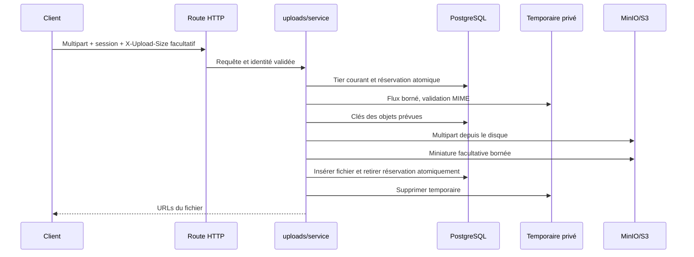

# Architecture backend

Le backend est un monolithe modulaire SvelteKit. Chaque module rassemble ses règles et ses accès aux ressources. Les routes adaptent les entrées et les erreurs HTTP; elles ne portent pas les règles de quotas. Il n'y a pas de framework d'injection, de couche générique de repositories ou de services supplémentaires.

## Parcours d'un upload

L'identité authentifiée vient du cookie signé, jamais du multipart. Le tier est lu en base, pas figé dans ce cookie. Un compte regroupe les identités web et Discord. Le tier `trusted` supprime les quotas métier, mais pas les protections techniques.

`uploads/service.ts` est l'interface commune à `/api/upload` et `/share-target`. Une modification de réception, validation ou compensation s'applique aux deux parcours. Le protocole HTTP existant est conservé; le client web ajoute `X-Upload-Size` pour une réservation précise.

## Invariants

- Un transfert possède une réservation avant la lecture du fichier. Une transaction courte verrouille la ligne compte; les uploads anonymes utilisent un verrou transactionnel par hash IP.
- Le quota comprend les fichiers déjà stockés et toutes les réservations encore actives. Le nombre de fichiers est réservé avec les octets.
- La réception compte les octets réels du fichier et du corps multipart. Ni le MIME annoncé, ni `Content-Length`, ni `X-Upload-Size` ne constituent une preuve.
- La taille déclarée doit correspondre au fichier reçu. Sans déclaration, le serveur réserve le maximum disponible jusqu'au plafond technique; cela évite une nouvelle route de préflight.
- Aucun original entier n'est matérialisé en RAM. La réception utilise la backpressure, le stockage des parties de 8 Mio avec deux workers, et les miniatures un chemin disque.
- Les temporaires ont des permissions privées. Deux uploads actifs au maximum par processus par défaut, avec réservation conservative de l'espace temporaire.
- Le suivi des clés S3 est durable avant leur écriture. Une interruption après écriture ne perd pas l'information nécessaire au nettoyage.
- La finalisation vérifie identité, expiration et taille, puis remplace la réservation par le fichier dans la même transaction. Un rejeu ne crée pas de second fichier.
- Une suppression ratée conserve son suivi en base. Le nettoyage réessaie les fichiers expirés et les objets des réservations abandonnées avant de supprimer leurs lignes.
- Un changement de tier ne supprime aucun fichier existant. Une rétrogradation dépassant le quota bloque les prochains uploads.

## Responsabilités

| Module                           | Propriété                                               |
| -------------------------------- | ------------------------------------------------------- |
| `accounts/session`               | Cookies signés et tokens opaques                        |
| `accounts/identity`              | Utilisateurs web et liens de connexion                  |
| `accounts/limits`                | Résolution des plafonds et attribution opérateur        |
| `accounts/reservations`          | Cohérence concurrente, comptabilité et finalisation     |
| `uploads/receive`                | Parser multipart, budgets de corps/fichier, temporaires |
| `uploads/validation`             | MIME détecté depuis le flux disque                      |
| `uploads/capacity`               | Slots et espace libre temporaire du processus           |
| `uploads/finalize`               | Finalisation et récupération d’un COMMIT incertain      |
| `uploads/service`                | Parcours complet et compensation                        |
| `storage/objects`                | S3, multipart, annulation et nettoyage des parties      |
| `storage/thumbnails`             | Sharp/ffmpeg, traitement facultatif                     |
| `files/repository`, `files/slug` | Métadonnées et noms de partage                          |
| `integrations`                   | Protocoles Discord et email Resend                      |
| `lifecycle/cleanup`              | Suppression et reprise après interruption               |
| `http/body`                      | Corps de requête hors uploads limités à 64 Kio          |

Les dépendances métier convergent vers PostgreSQL et le stockage. Il n'y a pas de dépendance depuis les modules vers les routes. Les fonctions pures de politique sont testables sans infra; les comportements de concurrence sont testés avec PostgreSQL, le parcours HTTP avec l'application construite et MinIO.

## Échec et reprise

Une erreur libère la réservation et supprime le temporaire. Si des objets S3 existent, le serveur tente leur suppression; en cas d'échec, il expire la réservation pour libérer le quota tout en conservant ses clés. Le nettoyage périodique reprend ces suppressions. Après un crash, la réservation reste active au plus `UPLOAD_TIMEOUT_SECONDS + 300` secondes, puis devient récupérable. Les temporaires de cette ancienneté sont également supprimés.

Les miniatures échouées ne bloquent pas un upload valide. Sharp limite le traitement à 40 millions de pixels; une image plus grande peut être conservée sans dimensions ni miniature. Le budget des miniatures est de 60 secondes. Les multipart inachevés sont listés et annulés par clé exacte avant suppression d’un objet abandonné, même après un crash. Les nettoyages S3 disposent aussi d'un timeout pour qu'une panne ne garde pas indéfiniment les slots.

Une réponse PostgreSQL perdue après COMMIT ne déclenche pas une suppression aveugle : `uploads/finalize` attend le même verrou compte/IP, puis cherche le fichier enregistré. Si la base reste inaccessible, le service conserve les objets pour réconciliation. Les requêtes PostgreSQL et l’acquisition de connexion sont bornées par des timeouts.

Une collision de slug après la recherche préalable n'annule pas le fichier : la finalisation réessaie avec son UUID public, sans slug.

La liaison Discord fusionne identités, fichiers et réservations dans une transaction et conserve le tier du compte cible. Le suivi de nettoyage survit à la suppression de l'ancien compte. Un transfert démarré sur le compte supprimé peut devoir être relancé; un ancien cookie peut nécessiter une nouvelle connexion.

## Exploitation et limites

Les quotas s'appliquent par compte. Les slots et le contrôle du volume temporaire s'appliquent par processus : plusieurs replicas nécessitent un budget global d'exécution si l'on veut borner la somme de leurs traitements. Le suivi PostgreSQL protège déjà les quotas entre replicas. Chaque replica doit gérer ses propres temporaires; le nettoyage S3 est idempotent.

Le contrôle d'espace libre porte sur le volume temporaire du web. La capacité totale du volume MinIO doit être surveillée par l'exploitation; aucun tier ne crée de capacité disque supplémentaire. Les quotas des anonymes et comptes standards restent essentiels.

`BODY_SIZE_LIMIT=Infinity` est intentionnel : les deux routes d'upload ont leurs propres compteurs; les autres corps de requête sont lus avec une borne de 64 Kio dans le hook. Pour ajouter une route de gros transfert, réutiliser ce parcours partagé au lieu d'ajouter une exception sans contrôle.

Les migrations Drizzle sont additives et générées depuis `packages/db/src/schema.ts`. Les anciennes applications conservent la compatibilité du schéma mais ne respectent pas les nouvelles réservations : ne pas les exécuter en parallèle avec ce backend. Un rollback logiciel laisse les colonnes en place; ne pas supprimer la table des réservations tant que des nettoyages attendent.

## Développer et vérifier

1. Modifier le module qui possède l'invariant, puis adapter les routes si l'interface change.
2. Ajouter un test du comportement observable, pas de la structure interne.
3. `bun run check` vérifie types, tests des modules et builds.
4. `bun run test:integration` démarre PostgreSQL/MinIO et un serveur de production isolés. Il doit passer après une modification du protocole, des réservations ou du stockage.
5. Pour tester directement la concurrence DB, appliquer les migrations sur une DB de test et lancer `UPLOAD_TEST_DATABASE_URL=postgres://... bun test apps/web/tests/accounts.integration.test.ts` dans un processus séparé des tests de stockage, dont la configuration est simulée.

Les tests de stockage vérifient aussi l'échec d'une partie, l'échec de finalisation multipart et l'annulation d'une requête S3. Les tests HTTP vérifient le parcours utilisateur complet, notamment les refus pendant réception, la concurrence et l'absence de fichiers/réservations/temporaire après erreur.
