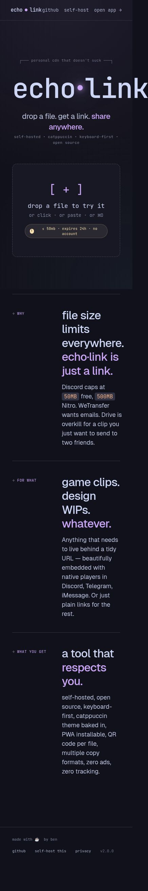
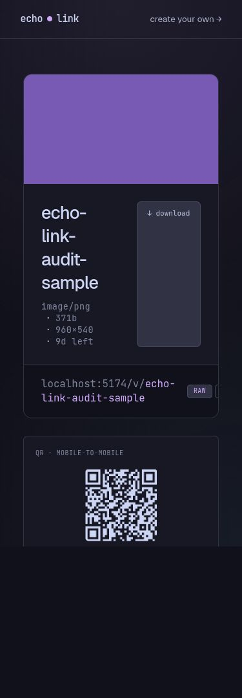

# Audit de l’interface Echo Link

Audit du 5 octobre 2026 avec Impeccable. L’interface nécessite des corrections fonctionnelles et responsive avant la refonte visuelle. Audit initial : 12 problèmes identifiés, 7 P1 et 5 P2. Les correctifs ont ensuite été implémentés dans cette session ; leurs preuves et limites de validation figurent ci-dessous. Aucun P0 identifié sur les parcours examinés.

## Périmètre et preuves

- Accueil, connexion, workspace connecté, palette, prévisualisation et édition, page de partage d’une image.
- Inspection navigateur desktop et mobile 390 × 844 ; revue indépendante du code par un sous-agent ; détecteur Impeccable.
- Upload réel d’une image synthétique de 960 × 540, compte fictif `audit@example.invalid`, stockage local PostgreSQL et MinIO.
- Reproduit = observé dans le navigateur ; code = défaut identifié dans les sources, sans reproduction complète du scénario.
- Typecheck `bun run lint` : 0 erreur, 0 avertissement. `bun run build` : web et bot réussis. Avertissement build : import QRCode inutilisé dans le rendu serveur.
- HTTP 200 pour l’accueil, `/api/health` et le fichier de test. Pas de validation d’envoi réel d’email, bot Discord, réseau lent, lecteur d’écran ou de tous les formats média.
- Détecteur : 9 alertes `border-accent-on-rounded`, toutes liées aux bordures des touches `<kbd>`. Faux positifs vérifiés, pas de correction recommandée sur ce signal.

| Dimension | Score | Constat |
| --- | --- | --- |
| Accessibilité | 1/4 | Focus, clavier, labels et contrastes défaillants |
| Performance | 3/4 | Miniatures optimisées ; mesures réseau et fluidité non réalisées |
| Responsive | 1/4 | Débordements et actions inaccessibles |
| Thèmes | 2/4 | Tokens centralisés, contrastes insuffisants |
| Intégrité des interactions | 1/4 | Retours d’upload et commandes incohérents |
| Total | 8/20 | Problèmes majeurs |

Scores de diagnostic Impeccable, pas une certification WCAG ni un benchmark de performance.

## Suivi des corrections

### 01 Mise en page et actions coupées sur mobile

- [x] **P1 · Responsive · Reproduit**
- Preuves : accueil à 390 px, largeur défilable 436 px et logo tronqué. Prévisualisation : bouton copy link à x = 402 px, hors écran ; téléchargement partiellement coupé. Page de partage : formats HTML et BBCode coupés, titre réduit à une colonne très étroite.
- Sources : `apps/web/src/lib/components/Brand.svelte:5`, `FilePreviewModal.svelte:317`, `ShareLinkBar.svelte:15`, `apps/web/src/routes/+page.svelte:148`, `apps/web/src/routes/v/[id]/+page.svelte:72`.
- Impact : accès dégradé ou impossible aux actions principales.
- Correction : logo fluide, sections marketing empilées sur mobile, actions de modale repliables ou empilées, formats de copie sur plusieurs lignes. Adapter aussi le lecteur audio avec `min-w-[320px]` et padding horizontal (`FilePreviewModal.svelte:219`).
- Validation : à 320, 390, 768 et 1280 px, pas de débordement horizontal ; tous les boutons visibles et utilisables ; noms longs et audio ne coupent pas les actions. Vérifier aussi le zoom 200 %.
- Commande : `impeccable adapt`.

### 02 Compte et sélection multiple inaccessibles au tactile

- [x] **P1 · Responsive et interactions · Menu reproduit, sélection vérifiée dans le code**
- Sources : `apps/web/src/routes/app/+page.svelte:485` et `:230`, `apps/web/src/lib/components/CommandPalette.svelte:75`, `FileGrid.svelte:54`.
- Preuves : bouton ouvrant la palette masqué sous 640 px ; déconnexion disponible uniquement dans la palette. Sélection multiple liée à Espace/A sans case tactile.
- Impact : utilisateur mobile sans clavier privé des réglages, de la déconnexion et des opérations multiples.
- Correction : menu de compte permanent, cases de sélection et action Tout sélectionner ; exposer l’état sélectionné aux technologies d’assistance.
- Validation : sur écran tactile 390 px, ouvrir réglages, se déconnecter, sélectionner deux fichiers et accéder aux actions multiples sans raccourci.
- Commande : `impeccable adapt`.

### 03 Résultat d’upload et récupération des liens non fiables

- [x] **P1 · Intégrité des interactions · Grille reproduite, lot anonyme vérifié dans le code**
- Sources : `apps/web/src/routes/app/+page.svelte:170` et `:176`, `apps/web/src/routes/+page.svelte:42` et `:56`, `apps/web/src/lib/components/Dropzone.svelte:23`.
- Preuves : upload réussi et ligne présente en DB, grille vide jusqu’au rechargement manuel. Le code attend la copie presse-papiers avant `invalidateAll`, sans gérer son échec. Côté anonyme, plusieurs fichiers acceptés mais seul `lastResult` conservé.
- Impact : résultat invisible ou liens précédents perdus côté interface ; risque de réupload inutile.
- Correction : dissocier upload, copie et rafraîchissement ; conserver état et lien de chaque fichier ; permettre copie manuelle avec confirmation réelle.
- Validation : copie autorisée, refusée et indisponible ; lot de deux fichiers ; succès partiel suivi d’échec. Chaque succès reste visible et récupérable, grille actualisée sans rechargement, aucune fausse confirmation de copie.
- Commande : `impeccable harden`.

### 04 Raccourcis globaux détournant les boutons

- [x] **P1 · Accessibilité clavier · Reproduit**
- Sources : `apps/web/src/lib/hooks/useShortcuts.svelte.ts:16`, `apps/web/src/routes/app/+page.svelte:242` et `:250`.
- Preuve : Espace sur le bouton d’upload sélectionne un fichier au lieu d’activer le bouton. La garde ignore les champs éditables mais pas les boutons/liens.
- Impact : comportement clavier inattendu, activation native empêchée.
- Correction : préserver les contrôles interactifs et limiter les raccourcis de navigation/sélection à leur contexte.
- Validation : Tab puis Entrée/Espace sur upload, copie et liens déclenchent leurs actions natives ; navigation et sélection dans la grille restent utilisables.
- Commande : `impeccable harden`.

### 05 Dialogues sans gestion correcte du focus

- [x] **P1 · Accessibilité · Reproduit et code**
- Sources : `apps/web/src/lib/components/FilePreviewModal.svelte:190`, `CommandPalette.svelte:129`, `KeyboardCheatsheet.svelte:87`.
- Preuves : prévisualisation ouverte, focus resté sur le bouton de grille derrière. Dialogues sans nom accessible ; confinement et restauration du focus absents.
- Impact : navigation clavier et lecture du contexte modal incohérentes.
- Correction : `<dialog>` correctement utilisé ou Dialog de bits-ui déjà installé ; nom accessible, focus initial, fond inerte, restauration à la fermeture.
- Validation : Tab/Shift+Tab restent dans chaque dialogue, Échap ferme selon le contexte, focus restauré au déclencheur, nom annoncé au lecteur d’écran.
- Référence : [W3C Modal Dialog Pattern](https://www.w3.org/WAI/ARIA/apg/patterns/dialog-modal/).
- Commande : `impeccable harden`.

### 06 Contrastes insuffisants entre thèmes

- [x] **P1 · Accessibilité et thèmes · Ratios calculés depuis les tokens**
- Sources : `apps/web/src/app.css:69`, `apps/web/src/lib/components/Dropzone.svelte:50`, `CommandPalette.svelte:149`, `FileRow.svelte:42`, `apps/web/src/routes/app/+page.svelte:289`.
- Preuves : Mocha overlay0/mantle 3,59:1 ; overlay1/surface0 3,40:1. Latte overlay1/mantle 2,63:1 ; green/mantle 2,75:1. Petits textes concernés, sous le minimum AA de 4,5:1.
- Impact : aides, compteurs et actions difficiles à lire, surtout en thème clair.
- Correction : tokens de texte distincts des couleurs décoratives, contrôle des combinaisons thème/accent réellement utilisées.
- Validation : texte normal ≥ 4,5:1 dans les quatre thèmes ; vérifier contrastes des états focus, erreur, succès et désactivé selon les critères applicables.
- Référence : [W3C Contrast Minimum](https://www.w3.org/WAI/WCAG22/Understanding/contrast-minimum.html).
- Commande : `impeccable colorize`.

### 07 Labels et annonces de connexion et upload manquants

- [x] **P1 · Accessibilité · Champ observé, annonces vérifiées dans le code**
- Sources : `apps/web/src/routes/login/+page.svelte:59`, `:53`, `:74`, `apps/web/src/routes/+page.svelte:112`, `:141`, `apps/web/src/routes/app/+page.svelte:318`.
- Preuves : champ email avec placeholder seul ; erreurs, confirmation et progression sans annonces adaptées.
- Impact : sens du champ et résultat des actions insuffisamment accessibles. Critères WCAG 3.3.2 et 4.1.3 concernés.
- Correction : label visible persistant, erreur associée, `status`/`alert`, progression sémantique sans annoncer chaque pourcentage.
- Validation : navigation clavier et lecteur d’écran sur saisie invalide, attente, erreur réseau, confirmation et upload ; état annoncé sans déplacement intempestif du focus.
- Commande : `impeccable harden`.

### 08 Annuler réouvre l’édition

- [x] **P2 · Intégrité des interactions · Reproduit**
- Source : `apps/web/src/lib/components/FilePreviewModal.svelte:160`.
- Reproduction : sélectionner un fichier avec Flèche bas, ouvrir avec E, cliquer Cancel. L’édition se réouvre et reprend le focus du titre.
- Cause : effet réappliquant `startInEdit` dès que `editing` devient faux.
- Correction : consommer le mode initial une seule fois par ouverture.
- Validation : après ouverture avec E, Annuler et Échap sortent de l’édition ; Enregistrer revient à la prévisualisation ; ouverture d’un autre fichier correcte.
- Commande : `impeccable harden`.

### 09 Échecs de suppression multiple masqués

- [x] **P2 · Intégrité des interactions · Code**
- Source : `apps/web/src/routes/app/+page.svelte:105` et `:114`.
- Preuve : réponses HTTP non-OK et exceptions ignorées ; sélection effacée, succès partiel ou zéro suppression sans explication utile.
- Impact : utilisateur ne sait pas quels fichiers restent à supprimer.
- Correction : bilan réussis/échoués, sélection des échecs conservée, nouvelle tentative possible.
- Validation : dans un environnement de test jetable, simuler un succès et un échec ; seul le succès disparaît, échec identifié et relançable.
- Commande : `impeccable harden`.

### 10 Animations et conseils rotatifs sans contrôle

- [x] **P2 · Accessibilité et mouvement · Code**
- Sources : `apps/web/src/lib/components/Brand.svelte:18`, `RotatingTip.svelte:17`, `apps/web/src/app.css`.
- Preuves : pulsation infinie, conseil remplacé toutes les sept secondes, absence de prise en compte de `prefers-reduced-motion`.
- Impact : distraction, lecture interrompue, inconfort pour utilisateurs sensibles au mouvement.
- Correction : variante statique en mouvement réduit, pause ou suppression de la rotation automatique des conseils.
- Validation : préférence système activée, interface statique avec états toujours compréhensibles ; conseil lisible sans remplacement forcé.
- Commande : `impeccable animate`.

### 11 Raccourcis affichés incohérents et hydratation

- [x] **P2 · Intégrité des interactions · Console et code**
- Sources : `apps/web/src/lib/components/RotatingTip.svelte:41`, `apps/web/src/lib/utils/platform.ts:9`, `apps/web/src/routes/+page.svelte:102`.
- Preuves : avertissement navigateur `hydration_html_changed` sur les conseils. SSR choisit Mac par défaut, client PC ; conseil initial peut rester incorrect. Accueil affiche ⌘O sans gestionnaire correspondant sur cette page.
- Impact : instruction clavier trompeuse, expérience incohérente selon plateforme.
- Correction : affichage initial cohérent serveur/client ; annoncer uniquement les raccourcis implémentés pour la page et la plateforme.
- Validation : chargement direct et navigation client sur PC/Mac, aucun avertissement d’hydratation, chaque raccourci affiché fonctionne.
- Commande : `impeccable harden`.

### 12 Refonte de la hiérarchie et de l’habillage

- [x] **P2 · Design · Jugement visuel partagé avec l’utilisateur**
- Sources : `apps/web/src/routes/+page.svelte:79`, `:147`, `apps/web/src/app.css:193`, `apps/web/src/lib/components/Brand.svelte`.
- Constat : accumulation fond à points, halos, logo géant, microtexte terminal, slogans et jargon Catppuccin/CDN. Identité perçue comme générique et « AI slop » par l’utilisateur.
- Impact : décoration dominante, compréhension du service moins directe, place perdue sur mobile.
- Direction proposée : priorité à choisir un fichier, comprendre les limites et récupérer le lien ; réduire les couches décoratives et le texte promotionnel. Direction à cadrer avant implémentation, pas encore validée comme design final.
- Validation : accueil compréhensible sans jargon ; action principale et limites visibles à 390 × 844 ; revue visuelle desktop/mobile avec l’utilisateur ; conserver fonctions et contenu factuel.
- Commandes : `impeccable shape`, puis `impeccable polish` après corrections.

## Observations secondaires

- Petites cibles tactiles : liens footer mesurés à 16,5 px de hauteur, formats de copie à 20,8 px. Prévoir des zones de contact confortables, idéalement 44 × 44 px ; ce repère ergonomique ne constitue pas à lui seul le seuil WCAG AA.
- Accueil : premiers titres en h3 sans h1 ; page de partage : titre en h2 ; layout global enveloppe toute la page dans main et page de partage contient un autre main. Revoir la structure sémantique pendant les corrections d’accessibilité.
- Pages de connexion avec token manquant/expiré : paramètres `error` produits côté serveur, mais non présentés dans le composant de connexion. Vérifier et rendre l’explication actionable.
- QR code : couleur claire fixée dans le composant, à contrôler en Latte.
- Succès de copie parfois annoncé sans attendre la promesse, notamment `copyLink` du workspace. Inclus dans la fiche 03.

## Points à préserver

Tokens de thèmes centralisés, restauration du thème avant premier rendu, miniatures serveur avec lazy loading et décodage async, boutons natifs, progression d’upload, dropzone désactivée pendant transfert et toast du workspace déjà annoncé par `role=status`.

## Ordre de travail

1. `impeccable adapt` : fiches 01 et 02.
2. `impeccable harden` : fiches 03, 04, 05, 07, 08, 09 et 11.
3. `impeccable colorize` : fiche 06 ; `impeccable animate` : fiche 10.
4. `impeccable shape` : fiche 12, avec direction visuelle explicite.
5. `impeccable polish`, puis nouvel audit et vérification des critères de chaque fiche.

Les cases indiquent les correctifs implémentés avec vérification par tests, code ou navigateur. Elles ne constituent pas une certification de tous les critères : zoom 200 %, lecteur d’écran et appareils physiques restent à valider. Les critères initiaux restent conservés pour cette validation complémentaire.

## Réalisation et vérification du 5 octobre 2026

Les 12 correctifs ont été implémentés dans l’ordre responsive, fiabilité/accessibilité, couleurs/mouvement, refonte puis finition. L’utilisateur a confirmé le remplacement de Catppuccin et le maintien de l’anglais. Nouvelle présentation : interface utilitaire, deux thèmes Light/Dark, accents Blue/Teal/Amber/Rose, upload au premier écran. Les anciennes préférences sont migrées avant le premier rendu.

| Fiche | Preuve de réalisation | Limite de validation |
| --- | --- | --- |
| 01 | Accueil sans débordement à 320/390/768/1280 ; formats partage tous visibles à 320 et boutons 44 px ; aperçu audio 256 px dans dialogue 286 px à 320 ; titre long avec accents/emoji sauvegardé sans couper les actions | Zoom 200 % non certifié ; téléphone physique non testé |
| 02 | Menu ouvert et déconnexion réellement effectuée à 390 ; cases tactiles et Tout sélectionner utilisés, trois fichiers sélectionnés à 320 | Essais sur navigateur intégré, pas téléphone physique |
| 03 | Upload connecté actualise la grille sans rechargement ; lot anonyme de deux images puis fichier non supporté conserve deux URLs ; succès/échec presse-papiers couverts par test, liens sélectionnables | Refus et absence clipboard simulés par test utilitaire ; copie réelle également réussie dans le navigateur |
| 04 | Espace sur Choose files ouvre le sélecteur ; trois tests de raccourcis natifs/scopés passent | Safari/Firefox non testés |
| 05 | Dialogue nommé dans l’arbre accessible ; Tab/Shift+Tab bouclent aux frontières ; Échap rend le focus au déclencheur ; test action modal 15 assertions | Annonce effective par lecteur d’écran non certifiée |
| 06 | 128 paires de texte/actions dans les deux thèmes ≥ 4,5:1 ; thèmes clair/sombre inspectés ; QR utilise modules sombres et fond clair | Pas de certification WCAG générale, tests de tokens ne couvrent pas tous les rendus composites |
| 07 | Email address est un label persistant ; lien invalide affiche une explication ; progression sémantique visible dans l’arbre accessible ; annonces status/alert présentes | Parcours au lecteur d’écran non certifié |
| 08 | Ouverture d’édition directe puis Annuler revient à l’aperçu ; sauvegarde de titre long puis titre restauré, focus sur Edit, sans boucle | Vérifié sur compte synthétique local |
| 09 | Test suppression : succès, HTTP en erreur, exception réseau et sélection vide ; échecs retournés et conservés sélectionnés côté UI | Échec DELETE testé avec fetch simulé, sans suppression réelle dans le navigateur |
| 10 | Plus de pulsation infinie ni rotation automatique ; Next tip explicite ; préférence reduced-motion retire mouvement de lignes et toast spatial tout en gardant états | Réduction du mouvement vérifiée dans le code, pas via changement réel de préférence OS |
| 11 | Conseils rendus en texte Svelte sans HTML injecté ; instructions homepage n’annoncent plus de raccourci absent ; ancien cycle de thèmes retiré ; tests de migration 126 combinaisons | Pas de matrice complète PC/Mac physique |
| 12 | Palette remplacée, fonds à points et halos retirés, logo contenu dans l’en-tête, action Choose files dominante ; revue indépendante finale ship | Choix utilitaire volontairement familier ; jugement visuel ne garantit pas conversion |

Le système visuel est documenté dans [DESIGN.md](../../apps/web/DESIGN.md), avec tokens et références de composants dans `.impeccable/design.json`. Les décisions produit confirmées figurent dans [PRODUCT.md](../../apps/web/PRODUCT.md).

Commandes durables : `bun run test`, `bun run lint`, `bun run build`.

`bun run test` exécute : quatre tests Bun clavier/modal (23 assertions), vérifications de copie et suppression partielle, 126 migrations/configurations de thème, 128 paires de contraste et 16 assertions de formats de partage. Les formats HTML/BBCode médias pointent désormais vers le fichier direct ; HTML échappe les titres et URLs. Ce défaut supplémentaire a été découvert pendant la validation des formats.

Le passage final du détecteur a produit neuf alertes sur `border-b-2`, associées aux touches et contrôles bordés, sans défaut bloquant démontré. La revue indépendante a demandé trois finitions : slogan redondant retiré, commandes harmonisées en Geist et focus réel sur boutons lors des flèches dans la palette. Ces finitions ont été revues avec de nouvelles captures : **ship**, aucun finding matériel restant dans ce périmètre.

La première exportation desktop était tronquée ; elle a été remplacée par une capture pleine page 1280 × 900 contrôlée avec `magick identify`. Les vues mobile ont une largeur de contenu de 375 px pour un viewport 390 px avec gouttière de défilement 15 px. Les captures clair/sombre distinguent compte connecté et accès anonyme ; l’absence de limites anonymes sur une capture connectée est conditionnelle, pas une omission.

### Captures après correction

- [Accueil sombre desktop](assets/2026-10-05/after/desktop.jpg)
- [Accueil clair desktop](assets/2026-10-05/after/desktop-light.jpg)
- [Accueil anonyme mobile](assets/2026-10-05/after/mobile.jpg)
- [Workspace mobile](assets/2026-10-05/after/workspace-mobile.jpg)
- [Palette mobile](assets/2026-10-05/after/palette-mobile.jpg)
- [Prévisualisation mobile](assets/2026-10-05/after/preview-mobile.jpg)

La capture des résultats de lot et la capture audio sont des preuves intermédiaires de fonctionnement, antérieures à l’harmonisation finale des libellés des boutons. Elles ne font pas autorité sur le style final.

## Révision après les retours utilisateur

Les verdicts précédents concernent la première itération, rejetée par l’utilisateur. Ils ne valident pas la composition mobile actuelle. Cette révision remplace le fond sombre vert par des neutres, souligne les liens au repos et rend visibles les états hover/active des boutons, y compris sélection et danger.

Le mobile a été recomposé : accueil compact avec sélection et limites au premier écran ; workspace avec sélecteur compact et une seule liste ; noms complets et actions View/Copy explicites ; liens d’upload conservés après copie ; Download prioritaire côté destinataire, formats avancés et QR repliables ; aperçu et palette avec marges adaptées, médias contraints et actions tactiles.

Preuves sur navigateur intégré aux viewports 320 × 740, 390 × 844 et desktop 1280 : upload réussi, lot PNG + TXT refusé partiellement sans perdre le succès, sélection de deux fichiers et copie réelle, titre long sauvegardé/annulé, partage et formats HTML copiés, audio chargé, QR ouvert/fermé au pointeur et avec Espace. Le contrôle QR mesure 44 px. Les exports avec gouttière peuvent mesurer 305 ou 375 px ; certaines captures montrent une portion défilée.

La revue indépendante de cette nouvelle composition a demandé deux corrections : affordance QR et récupération après échec partiel. Après correction et nouvelles captures, ces deux findings sont **resolved**, disposition **ship sur ces deux corrections uniquement**. Le reviewer a inspecté le code et les captures ; les preuves d’interaction et commandes sont celles exécutées par le parent. Aucun verdict de conformité générale n’est déduit.

Validation finale : `bun run test`, `bun run lint` et `bun run build` passent. Lint : zéro erreur, zéro warning. Tests : 4 tests Bun/23 assertions, copie/suppression, 126 configurations de thème, 146 paires de contraste et 16 contrôles de formats. Ces contrôles ne certifient pas tous les rendus composites. Téléphone physique, Safari/Firefox, zoom 200 % et lecteur d’écran restent non vérifiés.

Captures actuelles :

- [Accueil mobile](assets/2026-10-05/after-feedback/home-390.jpg)
- [Workspace mobile](assets/2026-10-05/after-feedback/workspace-390.jpg)
- [Upload partiel et lien conservé](assets/2026-10-05/after-feedback/partial-upload-320.jpg)
- [Partage mobile, QR fermé](assets/2026-10-05/after-feedback/share-details-320.jpg)
- [Partage mobile, QR ouvert](assets/2026-10-05/after-feedback/share-long-title-320.jpg)
- [Formats et copie HTML](assets/2026-10-05/after-feedback/formats-320.jpg)
- [Audio, thème clair](assets/2026-10-05/after-feedback/share-audio-light-390.jpg)
- [Aperçu avec titre long](assets/2026-10-05/after-feedback/preview-long-title-320.jpg)
- [Desktop](assets/2026-10-05/after-feedback/desktop-1280.jpg)

Le serveur local a été relancé avec la configuration explicite des conteneurs de test après un décalage de configuration observé (404 malgré les fixtures présentes). Page synthétique et fichier audio répondent à nouveau 200. Aucun fichier `.env` modifié pendant cette révision. Services laissés actifs, compte synthétique déconnecté et accueil ouvert.

## Captures initiales

## Environnement local de la session

- Application : `http://localhost:5174/`, Vite lié à `127.0.0.1`. Port 5173 déjà utilisé par un autre projet.
- Configuration injectée depuis `.env.example`, URLs publiques remplacées par localhost. Aucun fichier de configuration applicative créé.
- NixOS : démarrage avec `LD_LIBRARY_PATH` vers la bibliothèque libstdc++ de GCC pour charger sharp. Chemin de session : `/nix/store/2ga5nd1m56n5cx2wh8vbf6nrdhqk2f0q-gcc-15.3.0-lib/lib`, susceptible de changer après mise à jour du système.
- Conteneurs créés : `echo-link-audit-postgres` (PostgreSQL 18 Alpine, port localhost 5432) et `echo-link-audit-minio` (ports localhost 9000/9001). PostgreSQL diffère du compose du dépôt, qui utilise la version 16. Migrations appliquées, bucket privé créé.
- Arrêt des services de données : `docker stop echo-link-audit-postgres echo-link-audit-minio`. Serveur Vite : interrompre son processus de lancement. Les services sont laissés actifs à la demande de l’utilisateur.
- Échantillon et compte fictifs conservés dans ces conteneurs locaux pour reproduire les constats. Aucun envoi réel de magic link ni démarrage du bot.
- La phase initiale d’audit était en lecture seule ; les corrections applicatives décrites ci-dessus ont ensuite été autorisées. Les modifications préexistantes de documentation/configuration ne font pas partie de ce travail.
